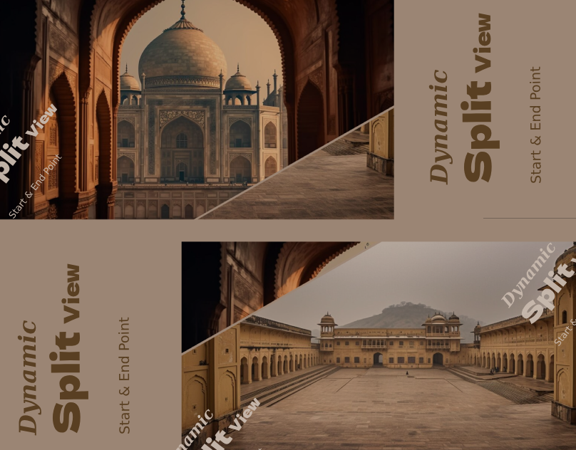

# Dynamic Split View

### Author
##### Virendra D. Verma

<a href="https://www.linkedin.com/in/dharmendraverma95/" target="_blank">LinkedIn Profile </a>

<a href="https://www.behance.net/dhirukumar" target="_blank">Behance Profile </a>

# Project Overview

Dynamic Split View is an interactive landing page design featuring two images that are displayed diagonally. On hover, the images dynamically reveal and hide in a seamless transition, creating an engaging user experience. This effect can be used for showcasing product images, portfolios, or any other visual content with a captivating presentation.

## Features
- Diagonal Image Split: Two images are shown diagonally, each taking half of the view.
- Hover Effect: On hover, one image slides to reveal the other, creating an interactive experience.
- Responsive Design: Fully responsive, works across different screen sizes and devices.
- Smooth Transitions: CSS animations for smooth image transitions on hover.

# Preview
Dynamic Split View
 

 
Dynamic Split View Start & End Point 
 

 
Cover
 

 

### Technologies Used
<ul>
  <li>Graphic Design Software: Photoshop, Figma (for mockups)</li>
  <li>Web Tools (Optional): HTML5, CSS3  for any digital presentations or landing pages</li>
  <li>For clean and modern typography.
</li>
</ul>
